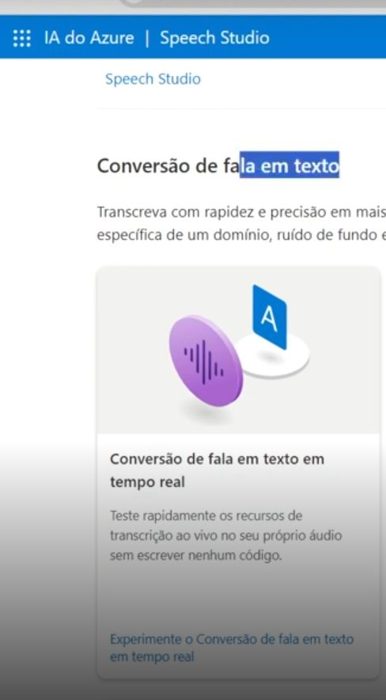

# Descrição 
Este é foi feito para concluir o desafio dentro do curso de **Análise de Sentimentos com Language Studio no Azure AI** da DIO.

# Objetivos

* ✅️ Assistir a todas as vídeos-aulas.
* Criar um repositório público no GitHub contendo.
    * ✅️ Um arquivo README.md detalhado 
Quaisquer arquivos adicionais que sejam relevantes para documentar sua experiência 
Opcionalmente, capturas de tela relevantes organizadas em uma pasta /images.
* ✅️ Entregar Projeto
    
# Na prática
## IA do Azure | Speech Studio
Para usar o recurso de transcrição. Pesquise na plataforma IA do Azure sobre speech Studio ou pelo google. 
Após acessar, clique na opção **Conversão de fala em texto**. como mostrar a imagem

#### 
 Imagem - Conversão de fala em texto, entrada. 

  

No ambiente como mostra a imagem "ambiente" pode selecionar o idioma do aúdio e carregar o aúdio. 

####  
 Imagem - Ambiente.	
		

  

Em seguida observamos o resultado da tasncrição na image **Resultados de teste**. Além disso, observe no bloco **Esoclher os arquivos de áudio**, podemos gravar ou carregar um aúdio.

####  
 Imagem - opções.	
		

  

####  
 Imagem - Aúdios.	
		

  

## IA do Azure | Analise de Sentimentos
Acesse o portal da Azure. Clique em Create a resource (), depois "AI+ Machine Learning e Language service - Create. Como mostra as imagens - Portal e Language service

####  
 Imagem - Portal.	
		

  

####  
 Imagem - Language Service.	
		

  

Na parte de criar vamos selecionar algumas características e criar! Essa etapa irá demorar um pouco pois também irão fazer verificações na conta. Imagens relacionadas 

####  
 Imagem - Criando serviço .	
		

  

####  
 Imagem - Configurando idiomalanguage.	
		

  

Após criado como mostra a imagem - Criado, aparecerá o nome do serviço de análise de sentimentos que foi configurado, como mostra a imagem - criado idiomalanguage

####  
 Imagem - Processando.	
		

  

####  
 Imagem - Criado.	
		

  

####  
 Imagem - idiomalanguage.	
		

  

####  
 Imagem - Observe idiomalanguage na lista.	
		

  

Então seremos direcionado para outra página, clique em criar configure!

####  
 Imagem - Criando uma análise idiomalanguage na lista.	
		

  

####  
 Imagem - Configurando.	
		

  

Depois selecione "Classify text" e "Analyze sentiment and mine opnions".

####  
 Imagem - Selecionando.	
		

  

No bloco como a imagem "Text" mostra um bloco da página com opção de selecionar o idioma, o serviço, no caso idiomalanguage que foi criado, e local para colocar o texto. 
Será colado o texto, como mostra a imagem - Opnião sobre o hotel.

####  
 Imagem - Text.	
		

  

####  
 Imagem - Opnião sobre o hotel.	
		

  

Deipois de clicar para roldar podemos observar os sentimentos do comentário do cliente na imagem - Resultado. Observe que de fato o comentário é negativo, e o modelo classificac corretamente e ainda mostra o nivelamento dos setimentos em "Sentence sentiment", traz a conclusão da opnião sobre o hotel em "opnion" "target: hotel" e opnião sobre o serviço na "target: service" .

####  
 Imagem - Resultados.	
		

  

Além disso, ele dar mais detalhes para que você possa conferir seu raciocínio.

####  
 Imagem - Resultados.	
		

  

Isso, é tudo pessoal!

####  
 Imagem - Isso, é tudo pessoal!.	
		

  
